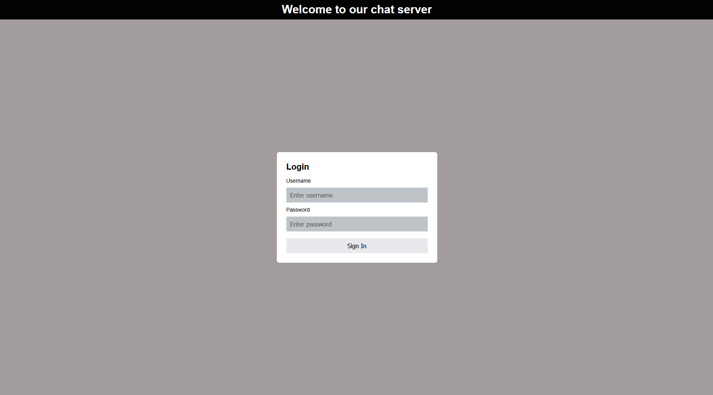
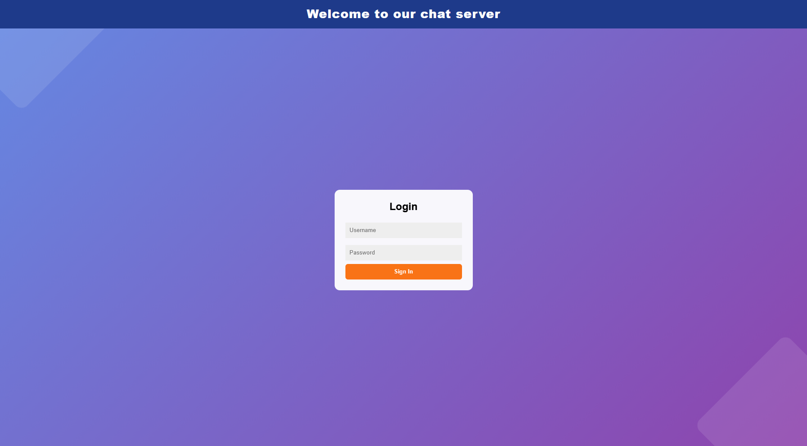
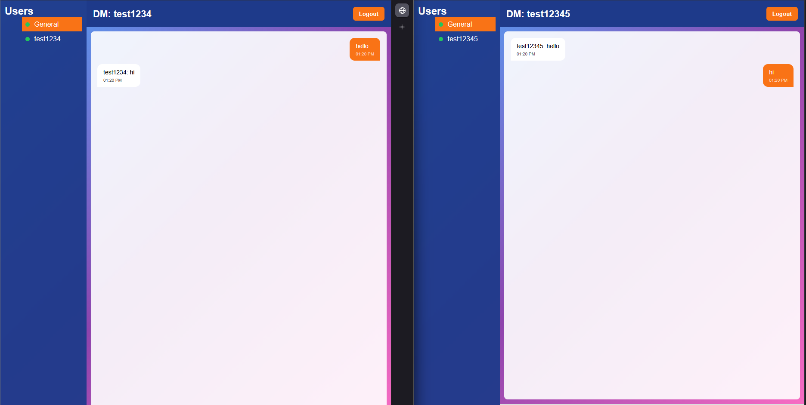

# SecureChat

## SecureChat is a real-time messaging application designed for teams to talk remotely like Slack or Teams. It allows users to message each other over encrypted connections.

# Team Contributions

- **Kosoknarith Mey** — implemented encryption files on the server, RSA/AES encryption testing, client-side encrypted direct messaging, automatic key generation during registration, public key storage and lookup, and server relay support for encrypted DM payloads.

- **Julian** — implemented the Direct Message feature, online user sidebar, chat routing between General Chat and DMs, sender/recipient display, online user list broadcast sync, LAN access setup, OpenSSL config template for self-signed certificates, password hashing, and brute-force protection for authentication.

- **Jude** — implemented login/register UI, chat interface styling, and related frontend improvements.

## Attribution Note

This project was completed collaboratively, and individual contributions are credited and based on the project changelog and implemented features.

## Requirements
 
- **Node.js** (tested with **v25.1.0**) + **npm**
- **Modern browser** (Chrome, Firefox)
- **OpenSSL** (tested with **v3.4.0**)
- **npm packages** (installed in the Server setup below):
  - [`ws`](https://www.npmjs.com/package/ws)
  - [`bcryptjs`](https://www.npmjs.com/package/bcryptjs)
  - [`dotenv`](https://www.npmjs.com/package/dotenv)

---

## Quick Start

### 1) Clone the repo

```cmd
git clone https://github.com/kosoknarith/securechat-group5.git
cd securechat-group5
```

### 2) Server setup

```cmd
cd server
npm i ws bcryptjs dotenv
```

#### Configure environment variables

1. In `server/`, copy `.env.example` to `.env`
2. Edit values as needed (used for password hashing settings)

#### (LAN) Configure certificate SAN for your LAN IP

Edit `server/openssl.cnf` and set `IP.2` to your server machine’s **LAN IPv4** address.

To find your LAN IP on Windows:

```cmd
ipconfig
```

#### Generate the TLS certificate + key

```cmd
npm run make-cert
```

#### Start the server

```cmd
node src/index.js
```

---

## Client (Browser)

- **Same machine as the server:**
  - `https://localhost:8080/login.html`
- **Another device on the same LAN:**
  - `https://<SERVER_LAN_IP>:8080/login.html`
  - Example: `https://192.168.xx.xx:8080/login.html`

---

## Usage

### Registering

1. Open the registration page: `https://localhost:8080/register.html`
   - Or on LAN: `https://<SERVER_LAN_IP>:8080/register.html`
2. Enter a username and password
3. Click **Register**
4. Return to the login page and sign in

### Logging in

1. Open the login page
2. Enter a valid username and password
3. Click **Sign In**

### Chatting

1. Click the chat input
2. Type a message
3. Click **Send** or press <kbd>Enter</kbd>

---

## LAN Troubleshooting

### Symptom: `https://<SERVER_LAN_IP>:8080` takes too long to respond

**Fix (worked in testing): switch Windows network profile from Public → Private**

- Windows Settings → Network & Internet → (Wi‑Fi/Ethernet) → Properties
- Change **Network profile** to **Private**
- Restart the server and retry the LAN URL

> Firewall behavior can differ between Public and Private profiles.

---

## Planned Features
- [X] Replace hardcoded users and password
- [X] adding a seperate register page or something of that sort
- [X] allowing use outside localhost
- [X] direct messages

## Screenshots

| Screenshot | Notes |
|---|---|
|  | Old UI (before redesign) |
|  | New UI (after redesign) |
|  | Direct Message + New UI |